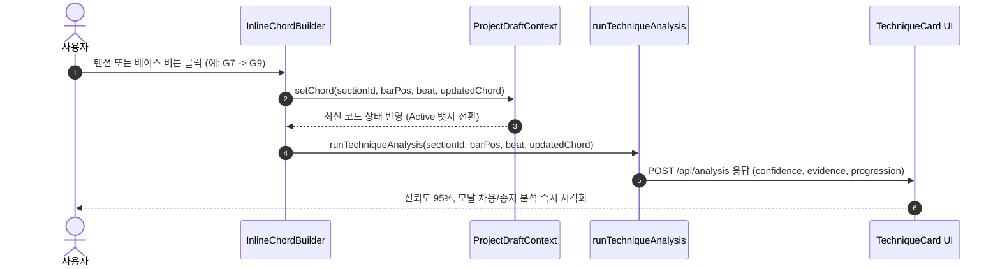

# Frontend 기능 고도화 작업 계획서 (FE Enhancements)

본 문서는 `fe-todo.md`(FE Wave 0~6 완료) 이후 추가되는 작곡 워크플로우 고도화 요구사항을 체계적으로 관리하고 개발하기 위한 계획 문서입니다.

---

## 📌 신규 요구사항 요약

1. **4마디 추천 진행 자동 새로고침 (Auto-Refresh on Chord Input)**
   - 선택된 4마디 블록 내 특정 마디/박자에 코드가 입력되거나 변경·삭제되면, 해당 코드가 포함된 추천 목록으로 자동 새로고침되어야 한다.
   - 이때 사용자가 선택해 둔 정렬 기준(`대중성 우선`, `코드 연결성 우선`, `다양성 우선`, `무작위`)은 초기화되지 않고 그대로 유지되어야 한다.
2. **전체 송폼 보기 화면 (Full Song Form Overview & Direct Edit)**
   - 송폼 구간 목록 영역 상단에 `[전체 송폼 보기]` 액션을 배치한다.
   - 클릭 시 한 화면(카드 형태)에서 곡 전체 송폼(Intro, Verse, Chorus, Bridge, Outro 등)의 모든 코드 진행을 한눈에 조망하고, 각 마디의 코드를 즉시 확인하고 직접 수정할 수 있어야 한다.
   - 좌측 송폼 목록에서 드래그 앤 드롭 또는 상/하 버튼으로 구간 순서를 변경하면, 전체 송폼 보기 화면에서도 순서가 실시간으로 즉시 반영되어야 한다.

---

## 1. 기능 1: 4마디 추천 진행 자동 새로고침

### 1.1 현상 분석 및 원인
- **현재 동작**:
  - `RecommendationPanel.tsx`의 `useEffect` 의존성 배열이 `[section?.id, startBar, tonic, activeSort, targetBars.length]`로 구성되어 있습니다.
  - 마디 내 코드가 새로 입력되거나 변경되어도 `targetBars.length`(마디 수) 자체는 4개로 동일하므로 `useEffect`가 트리거되지 않아 추천 목록이 자동으로 갱신되지 않습니다.
  - 사용자가 추천을 갱신하려면 다른 정렬 탭을 누르거나 블록을 다시 클릭해야 하는 번거로움이 있습니다.

### 1.2 요구사항 상세
1. **코드 변경 감지 및 자동 갱신**:
   - 상단 다이어토닉 퀵 팔레트 클릭, 단축키(`1~7`), `ChordEditModal` 저장, 마디/코드 삭제(`Delete`/`Backspace`) 등 어떤 경로로든 타겟 블록(4마디)의 코드가 변경되면 즉시 추천 API(`/api/recommendations`)가 새로 입력된 코드를 반영하여 자동 호출되어야 한다.
2. **정렬 탭 유지 (Preserve Active Sort)**:
   - 자동 새로고침 발생 시 사용자가 선택한 정렬 탭(`activeSort`)은 유지되어야 한다.
   - 페이지(`page`)는 1페이지로 리셋되고, 다양성 누적 제외 목록(`excludedDiversityGroups`)은 새 입력 컨텍스트에 맞춰 초기화된다.
3. **예외 상태 자연 전환**:
   - 코드가 채워져 4마디가 모두 채워지면 자동으로 `all_filled` 화면으로 전환된다.
   - 마디 내 2개 이상의 복수 코드가 입력되면 자동으로 `multi_chord_excluded` 화면으로 전환된다.
4. **호출 최적화 (Debounce)**:
   - 키보드 연속 입력이나 빠른 코드 교체 시 불필요한 연속 API 요청을 방지하기 위해 150ms 수준의 디바운스(Debounce)를 적용한다.

### 1.3 기술적 구현 방안
- `RecommendationPanel.tsx`:
  - `targetBars` 내 코드들의 상태 지문(Fingerprint) 생성:
    ```typescript
    const targetChordsFingerprint = JSON.stringify(
      targetBars.map((b) => b.chords.map((c) => `${c.beat}:${c.degree}${c.quality}${c.extension || ""}/${c.bass_degree || ""}`))
    );
    ```
  - `useEffect` 의존성에 `targetChordsFingerprint`를 포함하여 코드 내용 변경 시 `fetchRecommendations(1, activeSort, [])` 자동 트리거
  - 언마운트 및 연속 입력 시 이전 비동기 타이머/요청을 취소하는 클린업 로직 추가

---

## 2. 기능 2: 전체 송폼 보기 화면 (Full Song Form Overview)

### 2.1 현상 분석 및 필요성
- **현재 동작**:
  - 중앙 작업영역(`ChordChartGrid`)은 항상 좌측에서 선택된 단 1개의 `activeSection`(예: Verse 8마디)만 렌더링합니다.
  - 곡 전체의 기승전결(Intro → Verse → Pre-Chorus → Chorus → Bridge → Outro)과 화성적 흐름을 종합적으로 조망하거나, 여러 구간의 코드를 오가며 수정하려면 매번 좌측에서 구간을 일일이 클릭하여 전환해야 합니다.

### 2.2 요구사항 상세
1. **진입 및 토글 UX**:
   - 좌측 송폼 구간 목록(`SectionList.tsx`) 영역 상단("송폼 구간" 헤더 위)에 `[📄 전체 송폼 보기]` 버튼(또는 뷰 전환 토글 바)을 배치한다.
   - 현재 전체 보기 모드인지, 개별 구간 보기 모드인지 시각적으로 명확히 표시한다 (Active 상태 강조).
2. **원스톱 송폼 카드 뷰**:
   - 중앙 작업영역에 모든 등록된 구간(`project.sections`)이 하나의 일체형 대형 카드 뷰로 나열된다.
   - 각 구간 섹션별로:
     - 구간명 헤더 (예: `Intro (4마디)`, `Verse (8마디)`, `Chorus (8마디)`)
     - 해당 구간의 4/4 코드 그리드가 온전히 렌더링됨
   - 뷰 모드(1마디 1코드 뷰, 4박 분할 뷰)가 모든 구간에 매끄럽게 적용된다.
3. **전체 송폼 모드 내 실시간 코드 편집**:
   - 전체 송폼 보기 모드에서도 임의의 구간, 임의의 마디/박자를 클릭하여 포커스를 지정하고 코드를 직접 입력/수정/삭제할 수 있어야 한다.
   - 상단 다이어토닉 퀵 팔레트, 단축키(`1~7`), `ChordEditModal`이 완벽하게 연동된다.
4. **구간 순서 변경 시 실시간 동기화**:
   - 좌측 송폼 패널에서 드래그 앤 드롭(DND)이나 `▲`/`▼` 버튼으로 송폼 순서를 변경하면, 전체 송폼 보기 화면에서도 해당 구간 카드들의 순서가 즉시 재배치되어야 한다.
   - `ProjectDraftContext`의 `project.sections` 배열을 공유하므로 상태 불일치 없이 실시간 동기화된다.
5. **단일 구간 보기로의 쉬운 복귀**:
   - 전체 송폼 모드에서 특정 구간 카드의 헤더나 좌측 목록의 특정 구간을 클릭하면 해당 구간 단일 뷰로 손쉽게 전환/포커스할 수 있다.

### 2.3 기술적 구현 방안
1. **상태 설계 (`WorkspaceShell.tsx`)**:
   - `viewMode: "single" | "all"` 상태 도입 (기본값 `"single"`)
   - `activeSectionId`가 `null`이거나 `viewMode === "all"`일 때 전체 송폼 뷰 활성화
2. **신규 컴포넌트 작성 (`FullSongFormView.tsx`)**:
   - 경로: `app/components/chordchart/FullSongFormView.tsx`
   - 역할: `project.sections`를 순서대로 매핑하여 섹션 카드 컨테이너를 구성하고, 내부에서 기존 마디 렌더링 로직(`BarCard`)을 재사용
   - 섹션 간 시각적 구분선, 구간별 누적 마디 번호(예: Intro 1~4마디, Verse 5~12마디 등 전체 누적 번호 또는 구간 내 번호) 표시
3. **`SectionList.tsx` 상단 네비게이션 확장**:
   - `[전체 송폼 보기]` 및 `[구간별 보기]` 세그먼트 토글 버튼 추가
   - DND 순서 변경 시 `reorderSections` 호출 → `project.sections` 불변 업데이트 → `FullSongFormView` 즉시 재정렬

---

## 3. 단계별 작업 순서 (Action Plan)

### Step 1. 4마디 추천 자동 새로고침 & 정렬 유지 구현
- [x] `RecommendationPanel.tsx`에 `targetChordsFingerprint` 의존성 및 디바운스 적용
- [x] 코드 입력/수정/삭제 시 `activeSort`를 보존한 채로 `/api/recommendations` 자동 호출 검증
- [x] 4칸 입력 완료 시 `all_filled`, 복수 코드 시 `multi_chord_excluded` 자동 화면 전환 검증
- [x] `test/fe-enhancement-recommendation.test.ts` 단위/통합 테스트 작성

### Step 2. 전체 송폼 보기 UI 컴포넌트 구현
- [x] `FullSongFormView.tsx` 컴포넌트 신규 작성 (`app/components/chordchart/FullSongFormView.tsx`)
- [x] 모든 송폼 구간의 순차적 렌더링 및 개별 마디 클릭/선택 이벤트 연결
- [x] 전체 송폼 뷰에서의 코드 편집(팔레트, 단축키, `ChordEditModal`) 동작 보장
- [x] 특정 송폼 카드 최소화/접기 및 전체 접기/펼치기, 접힌 상태 코드 진행 요약 뱃지 프리뷰 구현

### Step 3. 좌측 송폼 상단 네비게이션 & 실시간 순서 동기화
- [x] `SectionList.tsx` 상단에 `[전체 송폼 보기]` 버튼/토글 UI 추가
- [x] `WorkspaceShell.tsx`에서 `viewMode` 상태 제어 및 중앙 화면 조건부 렌더링
- [x] 좌측 송폼 드래그 앤 드롭 및 `▲`/`▼` 순서 변경 시 전체 송폼 카드의 즉각적인 순서 재배치 검증

### Step 4. 통합 검증 및 문서화
- [x] `test/fe-enhancement-overview.test.ts` 테스트 작성 (전체 송폼 렌더링, 코드 수정, DND 순서 동기화, 카드 최소화)
- [x] `npm test` 100% 통과 (55/55) 및 `npm run typecheck`, `npm run build` 검증 완료
- [x] `wave_log/fe-wave-enhance1.log` 기록 및 `fe-enhancements.md` 완료 체크

---

## 4. 검증 기준 (Definition of Done)

1. **추천 자동 갱신**:
   - 4마디 블록의 1번 마디에 C 코드를 넣는 즉시 우측 추천 목록이 C로 시작하는 추천으로 자동 갱신된다.
   - 정렬 유형이 `코드 연결성`인 상태에서 코드를 변경해도 여전히 `코드 연결성` 정렬 탭이 유지된다.
2. **전체 송폼 보기 & 편집**:
   - `[전체 송폼 보기]` 클릭 시 Intro, Verse, Chorus 등 모든 구간의 마디가 하나의 화면에 질서정연하게 표시된다.
   - 전체 송폼 화면에서 특정 마디를 클릭해 코드를 바꾸면 초안에 즉시 반영된다.
   - 좌측에서 Verse를 맨 위로 드래그하면 전체 송폼 화면의 맨 위 카드도 즉시 Verse로 변경된다.
   - 각 구간 카드의 `[▼ 펼치기]`/`[▲ 최소화]` 및 상단 `[모두 접기]`/`[모두 펼치기]`를 통해 송폼 화면을 컴팩트하게 정리할 수 있다.
3. **안정성**:
   - 기존 모든 테스트를 포함하여 전체 테스트(55개)가 100% 통과하고, TypeScript 및 빌드 에러가 없어야 한다.

---

## 5. 백엔드 화성 분석 엔진 고도화 검토 및 프론트엔드 작업 로드맵

`be-enhancements.md` 및 `wave_log/be-wave-enhance0.log` ~ `be-wave-enhance5.log`의 백엔드 구현 내역을 전수 검토하고, 프론트엔드(FE) 작업 착수 가능 여부와 구체적인 개발 절차 및 방식을 수립한 결과입니다.

---

### 5.1 백엔드 구현 현황 검토 (BE Implementation Review)

`wave_log/be-wave-enhance0.log`부터 `be-wave-enhance5.log`까지의 기록을 바탕으로 확인된 백엔드 화성 분석 엔진(`POST /api/analysis`)의 고도화 구현 상태는 다음과 같습니다:

| 단계 | 범위 및 파일 | 주요 구현 및 반환 데이터 | 상태 |
|---|---|---|---|
| **Step 0 & 1** (`be-wave-enhance0.log`) | • 입력 정규화기 (`analysis-context.ts`)<br>• 기준선 고정 (`test/fixtures/`) | • `NormalizedBarChord`, `NormalizedBar` 도입<br>• 명시적 `beat` 보존 및 레거시 누락 시 1-indexed fallback 보정<br>• 복수 코드 마디의 중간 박 변경 분석 억제 (첫 박/마지막 박 관계 분석) | **완료** |
| **Step 2** (`be-wave-enhance1.log`) | • 화성 수학 모듈 (`harmonic-math.ts`) | • 도수 간 반음 거리 계산, 완전 5도 하강 및 반음 상행 관계 판별<br>• 다이어토닉 검증 및 베이스 라인 모션 분류 (`stepwise_down/up`, `pedal`, `none`) | **완료** |
| **Step 3** (`be-wave-enhance2.log`) | • 플러그형 매처 (`technique-matcher.ts`) | • 매처 레지스트리 구축 (`modal-interchange`, `secondary-dominant`, `slash-chord`, `chord-variation`)<br>• `confidence`(0.0~1.0), `evidence`(문구 배열) 메타데이터 반환 | **완료** |
| **Step 4** (`be-wave-enhance3.log`) | • 기존 기법 정밀화 | • 세컨더리 도미넌트 dominant 7/9 지원 및 `targetDegree` 출력 (VII 감화음 타깃 오탐 방지)<br>• 세컨더리 리딩톤 디미니시드(`secondary_leading_tone`) 매처 및 시드 추가<br>• 모달 인터체인지 `bVII`, `bIII` 추가 및 `sourceMode` 출력<br>• 슬래시 코드 전위(`1st/2nd/3rd Inversion`, `slash_bass`) 분류 | **완료** |
| **Step 5** (`be-wave-enhance4.log`) | • 4마디 블록 종지 및 진행 분석 (`progression-analyzer.ts`) | • 정격 종지(`V → I`), 반종지(`... → V`), 변격 종지(`IV → I`), 기만 종지(`V → VI`)<br>• `ii - V - I`, `IV - V - I`, 5도권 순환, 2마디 루프 진행 판별<br>• `progressionPattern` (최고 신뢰도) 및 `progressionAlternatives` 배열 반환 | **완료** |
| **Step 6** (`be-wave-enhance5.log`) | • 베이스 라인 및 고급 재화성 분석 | • 하강 베이스 라인, 상승 베이스 라인, 페달 포인트 분석<br>• 고급 매처: 트라이톤 대리(`tritone_substitution`), 백도어 도미넌트(`backdoor_dominant`), 크로매틱 미디언트(`chromatic_mediant`), 패싱/공통음 디미니시드<br>• 시드 규칙 13종 확장 완료<br>• 다중 대안 해석(`technique.alternatives`) 및 요청 분석 컨텍스트(`context`) 반환 | **완료** |

- **백엔드 테스트 현황**: 단위/통합 테스트 총 69개 **100% 통과** (`69 passed`, 0 failed) 확인.

---

### 5.2 FE 작업 진행 가능 여부 평가 (Readiness Assessment)

- **판정**: 🟢 **즉시 진행 가능 (100% Ready to Proceed)**
- **평가 근거**:
  1. **API 완전성**: `POST /api/analysis` 엔드포인트가 이미 백엔드 Wave A, B, C 전체 고도화 항목을 수용하여 `technique`, `progressionPattern`, `progressionAlternatives`, `context`를 모두 정상 반환하고 있습니다.
  2. **하위 호환성 보장 (Zero Regression)**: 기존 프론트엔드가 소비하던 `technique.id`, `technique.name`, `technique.description` 필드가 100% 보존되어 있어, FE 작업 중에도 기존 화면이 깨지지 않고 점진적 고도화가 가능합니다.
  3. **클라이언트 결함 사전 파악 완료**: `WorkspaceShell.tsx`의 `blockStart: 1` 하드코딩 버그와 chords 내 `beat` 누락 문제의 원인 및 해결책이 명확히 도출되어 있어 즉각적인 보정이 가능합니다.

---

### 5.3 프론트엔드 진행 절차 및 개발 방식 (Procedures & Methodology)

#### A. 개발 기본 원칙 (Core Methodology)
1. **점진적 무회귀 확장 (Additive Non-Breaking Integration)**:
   - 신규 필드는 모두 옵셔널(`?`)로 처리하여, 분석 결과가 없거나 일부 필드가 누락되어도 기존 뷰가 부드럽게 폴백(Graceful Degradation)되도록 구현합니다.
2. **단방향 상태 흐름 (Unidirectional Data Flow)**:
   - `ProjectDraftContext`와 `WorkspaceShell.tsx`에서 분석 결과를 일원화 관리하고, UI 컴포넌트(`TechniqueCard.tsx`, `FullSongFormView.tsx`)는 props를 통해 순수하게 렌더링합니다.
3. **사용자 경험 극대화 (Musician-Friendly UX)**:
   - 복잡한 화성학 분석 결과를 한눈에 이해할 수 있도록 **신뢰도 게이지**, **성립 근거 불릿**, **종지 아이콘 뱃지**, **대안 해석 아코디언** 등 직관적인 시각 언어로 표현합니다.

---

#### B. 단계별 진행 절차 (Phased Action Plan)

```text
Phase 1 (기반 정비)  : 타입 정의 확장 + API 요청 파라미터 버그 수정 (blockStart 동적화, beat 명시)
       ▼
Phase 2 (트리거 연동): 다이어토닉 클릭 외 단축키(1~7), 모달 저장, 추천 적용 시 분석 트리거 다변화
       ▼
Phase 3 (UI 전면 개편): TechniqueCard.tsx 입체적 화성학 리포트 카드 UI 구현 (근거, 종지, 대안 해석)
       ▼
Phase 4 (뷰 통합)    : 전체 송폼 뷰(FullSongFormView) 및 마디 카드와의 실시간 분석 동기화
       ▼
Phase 5 (검증 및 마감): 단위/통합 테스트(fe-enhancement-analysis.test.ts) 작성 및 100% 빌드/타입 검증
```

---

### 5.4 상세 구현 작업 명세

#### Phase 1: 클라이언트 타입 정의 및 API 요청부 정규화
1. **`app/types/client.ts` 확장**:
   ```typescript
   export type ProgressionPatternFeedback = {
     type: "cadence" | "progression" | "bassline";
     name: string; // 예: "정격 종지", "ii - V - I 진행", "하강 베이스 라인"
     description: string;
     bars: number[]; // 관련 마디 목록 [3, 4]
   };

   export type TechniqueAlternative = {
     id: number;
     name: string;
     description: string;
     confidence: number;
     evidence?: string[];
   };

   export type TechniqueFeedback = {
     id: number;
     name: string;
     description: string;
     targetBarPosition?: number;
     targetBeat?: number;
     // 신규 확장 필드
     confidence?: number;
     evidence?: string[];
     targetDegree?: string; // 세컨더리 타깃 도수 (예: "ii", "V")
     sourceMode?: string; // 차용 선법 (예: "Aeolian", "Mixolydian")
     inversion?: string; // 전위 정보 (예: "1st Inversion", "slash_bass")
     progressionPattern?: ProgressionPatternFeedback | null;
     progressionAlternatives?: ProgressionPatternFeedback[];
     alternatives?: TechniqueAlternative[];
   };
   ```
2. **`WorkspaceShell.tsx` 요청 정합성 수정**:
   - `blockStart: 1` 하드코딩 제거 → `blockStart: blockStart` (실제 블록 시작 번호 1, 5, 9... 동적 전달)
   - `bars` 배열 매핑 시 `beat: c.beat ?? 1` 명시적 전달

#### Phase 2: 분석 트리거 경로 다변화
- 다이어토닉 7코드 팔레트 클릭 외에 다음 사용자 조작 시에도 `runTechniqueAnalysis` 호출:
  1. 키보드 단축키 (`1~7`)로 코드 입력 시
  2. `ChordEditModal`에서 텐션/슬래시 코드 속성 수정 후 [저장] 시
  3. 4마디 추천 진행(`applyRecommendation`) 또는 사용자 진행을 차트에 적용할 때 블록 분석 갱신

#### Phase 3: `TechniqueCard.tsx` 입체적 화성학 리포트 카드 UI 개편
- **신뢰도 뱃지**: `confidence` 수치를 기반으로 일치율 뱃지 표시 (`95% 일치`, `높은 신뢰도`)
- **타깃 도수 & 차용 모드 뱃지**:
  - 세컨더리 도미넌트: `V7/ii` 형태의 타깃 도수 뱃지 (`목표: ii`)
  - 모달 인터체인지: `에올리안 차용` 뱃지
  - 슬래시 코드: `제1전위 (1st Inversion)` 뱃지
- **분석 근거(Evidence) 리스트**:
  - 백엔드에서 반환된 증거 문장들을 깔끔한 체크/불릿 리스트로 렌더링
- **4마디 블록 종지/진행 패턴 카드**:
  - `progressionPattern`이 반환되면 하단에 전용 섹션을 노출하여 종지명, 아이콘(🔔 정격 종지, ⏸️ 반종지, 🔄 ii-V-I 등), 설명 및 대상 마디 칩 표시
- **대안 해석(Alternatives) 아코디언**:
  - 복수 해석이 존재할 경우 `다른 화성학적 해석 보기 (N)` 토글을 제공하여 음악적 학습 및 다각적 해석 지원

#### Phase 4: 전체 송폼 뷰(`FullSongFormView.tsx`) 연동
- 전체 송폼 모드에서도 임의의 구간, 임의의 마디를 클릭하거나 코드를 변경했을 때, 해당 마디의 기법 분석 및 해당 블록의 종지 패턴이 우측 패널에 실시간으로 완벽히 동기화되도록 보장.

#### Phase 5: 통합 테스트 및 품질 검증
- `test/fe-enhancement-analysis.test.ts` 신규 작성
- 확장된 응답 수신, 상태 파싱, 컴포넌트 렌더링 검증
- `npm run typecheck`, `npm test`, `npm run build` 100% 통과 확인

---

### 5.5 작업 체크리스트 (FE Action Items)

- [x] **FE-Analysis-Step 1: 타입 및 API 호출부 정규화**
  - [x] `app/types/client.ts`에 `ProgressionPatternFeedback`, `TechniqueAlternative` 선언 및 `TechniqueFeedback` 확장
  - [x] `WorkspaceShell.tsx`의 `runTechniqueAnalysis` 내 `blockStart` 동적 계산 버그 수정 (`blockStart: 1` 제거)
  - [x] `bars` payload 전송 시 `beat: c.beat ?? 1` 명시 전달
- [x] **FE-Analysis-Step 2: 분석 트리거 경로 다변화**
  - [x] `ChordEditModal.tsx` 저장 시 `runTechniqueAnalysis` 호출 연결
  - [x] 키보드 단축키(`1~7`) 입력 시 `runTechniqueAnalysis` 호출 연결
  - [x] 4마디 추천 진행 적용(`applyRecommendation`) 시 블록 분석 갱신
- [x] **FE-Analysis-Step 3: `TechniqueCard.tsx` 리치 UI 구현**
  - [x] Confidence 프로그레스/뱃지 UI 추가
  - [x] Evidence 불릿 목록 렌더링
  - [x] `targetDegree`, `sourceMode`, `inversion` 칩 표시
  - [x] `progressionPattern` (종지/진행 패턴) 하위 섹션 렌더링
  - [x] `alternatives` (대안 해석) 아코디언 컴포넌트 추가
- [x] **FE-Analysis-Step 4: 전체 송폼 뷰 연계 및 동기화**
  - [x] `FullSongFormView.tsx` 내 마디 클릭/수정 시 분석 패널 동기화 보장
- [x] **FE-Analysis-Step 5: 단위/통합 테스트 작성 및 검증**
  - [x] `test/fe-enhancement-analysis.test.ts` 작성
  - [x] 신규 분석 응답 수신, 상태 파싱, 컴포넌트 렌더링 무결성 검증
  - [x] `npm run typecheck`, `npm test`, `npm run build` 100% 통과 검증

---

## 6. 코드 팔레트 인라인 상세 설정(Inline Chord Builder) 및 실시간 화성 분석 연동 기획

### 6.1 배경 및 문제의식 (Why Inline Builder over Modal)

1. **모달의 시각적 차폐 및 화성 분석 피드백 단절**:
   - 기존의 `ChordEditModal`은 화면 전체를 딤(dim) 처리하는 전형적인 다이얼로그 형태로, 모달이 열려 있는 동안 우측의 화성학 분석 카드(`TechniqueCard`)와 추천 패널(`RecommendationPanel`)이 완전히 가려집니다.
   - 따라서 사용자가 텐션(maj7, 9, 11)이나 베이스 전위(/3, /5), 세컨더리 도미넌트 프리셋을 시험해볼 때, 매번 `속성 선택 → [저장] 클릭 → 모달 닫힘 → 우측 분석 카드 확인`의 5~6단계를 거쳐야만 결과를 확인할 수 있어 즉각적인 학습과 탐색적 작곡에 큰 병목이 발생합니다.

2. **연속 마디 편집의 비효율성**:
   - 곡의 화성을 연속해서 편곡할 때 매 마디마다 모달을 열고 닫는 번거로움이 존재합니다.

3. **해결 전략: 인라인 드로어(Inline Accordion Builder)**:
   - 상단 다이어토닉 퀵 팔레트에 `[⚙️ 상세 설정 ▼]` 토글 버튼을 추가하고, 클릭 시 팔레트 바로 아래로 콤팩트한 화성 상세 빌더가 펼쳐지는 구조를 도입합니다.
   - 마디/박자가 선택된 상태에서 성질, 텐션, 베이스, 화성학 프리셋을 클릭하는 즉시 **차트의 코드가 변경되고 우측 `TechniqueCard`가 0.1초 만에 실시간 갱신**되어, 즉각적이고 직관적인 음악적 피드백 루프를 제공합니다.

---

### 6.2 UI/UX 아키텍처 및 화면 레이아웃 설계

```
┌─ [ 상단 코드 팔레트 & 인라인 빌더 영역 ] ──────────────────────────────────────────────┐
│ [C] [Dm] [Em] [F] [G] [Am] [Bdim]             │ [⚙️ 상세 설정 ▼] (토글 / Active 강조)  │
├───────────────────────────────────────────────────────────────────────────────────────┤
│ ▼ [선택 중: Chorus #3마디 1박 | 현재: G7] ───────────────────────────────────────────┤
│                                                                                       │
│ 1. 화음 성질(Quality) : [Major] [Minor] [Dominant] [Diminished] [Augmented] [Sus]     │
│ 2. 텐션/확장(Extension): [none] [7] [maj7] [9] [11] [13] [sus4] [sus2] [add9]          │
│ 3. 베이스 전위(Inversion): [Root 기본] [/3 (1st)] [/5 (2nd)] [/7 (3rd)] [커스텀 베이스] │
│ 4. 화성학 퀵 프리셋    : [V7/ii] [V7/IV] [V7/V] [IVm (에올리안)] [bVI] [bVII]          │
│ 5. 보조 액션          : [기본 3화음으로 리셋] [코드 삭제] [▲ 상세 설정 접기]           │
└───────────────────────────────────────────────────────────────────────────────────────┘
```

#### 주요 인터랙션 규칙:
1. **무선택 가이드**: 마디나 박자가 선택되지 않은 상태에서는 `"마디나 박자를 선택하면 상세 설정을 변경할 수 있습니다"` 안내 문구 표시.
2. **원클릭 즉시 반영 (Live Mutation)**:
   - 모달의 [저장] 버튼과 달리, 버튼 클릭 즉시 `setChord`가 디스패치되고 `runTechniqueAnalysis`가 호출됨.
   - 사용자가 여러 텐션을 빠르게 눌러보며 음향과 화성 분석 결과를 실시간으로 비교 가능.
3. **선택 상태 실시간 동기화 (Active Highlight)**:
   - 차트에서 다른 마디를 클릭하면, 해당 마디의 코드에 맞춰 성질(Quality), 텐션(Extension), 베이스(Bass) 버튼의 활성(Active) 테두리가 자동으로 전환됨.
4. **수직 공간 최적화**:
   - 불필요할 때는 `[▲ 상세 설정 접기]`를 통해 언제든 1행의 슬림한 다이어토닉 팔레트로 축소 가능.
   - 접힘/펼침 상태는 로컬 스토리지 또는 세션 상태로 기억.

---

### 6.3 상태 관리 및 실시간 분석(Live Analysis) 파이프라인



---

### 6.4 단계별 액션 플랜 (Phase 1 ~ Phase 4)

#### Phase 1: `InlineChordBuilder.tsx` 컴포넌트 신규 개발
- 성질(Quality), 텐션(Extension), 전위(Bass Degree), 화성학 프리셋(Secondary Dominant, Modal Interchange) 그룹 버튼 UI 구현
- 현재 선택된 마디/박자의 코드 속성을 파싱하여 해당 버튼들에 Active 상태 하이라이트 제공

#### Phase 2: `WorkspaceShell.tsx` 팔레트 영역 확장 및 연동
- 상단 다이어토닉 팔레트 우측에 `[⚙️ 상세 설정]` 토글 버튼 배치
- `isDetailExpanded` 상태를 기반으로 아코디언 드로어 형태로 부드럽게 펼쳐지도록 연출
- 인라인 빌더의 조작 이벤트를 `setChord` 및 `runTechniqueAnalysis`와 직결

#### Phase 3: 키보드 단축키 및 편의 기능 강화
- 기존 `1~7` 다이어토닉 숫자 단축키 외에, 상세 설정이 열려있을 때 텐션 토글 단축키 또는 방향키 연동성 검토
- 전체 송폼 뷰(`FullSongFormView.tsx`)에서도 동일한 상단 인라인 빌더가 완벽히 동작하도록 포커스 섹션 연동 유지

#### Phase 4: 단위/통합 테스트 작성 및 검증
- `test/fe-enhancement-inline-builder.test.ts` 작성
- 인라인 빌더에서의 속성 변경에 따른 Draft 상태 갱신 및 실시간 분석 파이프라인 검증
- `npm run typecheck`, `npm test`, `npm run build` 무결성 검증

---

### 6.5 작업 체크리스트 (FE Action Items)

- [x] **FE-InlineBuilder-Step 1: `InlineChordBuilder.tsx` 컴포넌트 개발**
  - [x] Quality (Major, Minor, Dominant, Diminished, Augmented, Sus) 버튼 그룹
  - [x] Extension (none, 7, maj7, 9, 11, 13, sus4, sus2, add9) 버튼 그룹
  - [x] Inversion / Bass Degree (Root, 3rd, 5th, 7th) 버튼 그룹
  - [x] Secondary Dominant & Modal Interchange 퀵 프리셋
  - [x] 현재 선택 코드 양방향 바인딩 및 Active 하이라이트
- [x] **FE-InlineBuilder-Step 2: `WorkspaceShell.tsx` 팔레트 드로어 결합**
  - [x] 상단 팔레트에 `[⚙️ 상세 설정]` 토글 버튼 추가
  - [x] 아코디언 슬라이드 드로어 UI 배치
  - [x] 속성 변경 시 `setChord` + `runTechniqueAnalysis` 즉각 연쇄 트리거
- [x] **FE-InlineBuilder-Step 3: 전체 송폼 뷰 연계 및 반응형 최적화**
  - [x] `FullSongFormView`에서도 선택된 구간/마디에 맞춰 인라인 빌더 활성화
  - [x] 슬림 모드 및 반응형 줄바꿈 디자인
- [x] **FE-InlineBuilder-Step 4: 단위/통합 테스트 및 검증**
  - [x] 인라인 속성 수정 및 실시간 분석 트리거 단위 테스트 작성
  - [x] `npm run typecheck`, `npm test`, `npm run build` 100% 통과 검증

---

## 7. 다중 송폼 구간 일괄 생성 및 새 프로젝트 커스텀 송폼 빌더 (Bulk Section & Custom Project Songform Builder)

### 7.1 배경 및 문제의식 (Why Bulk Section Builder)

1. **단일 구간 반복 생성의 피로도**:
   - 현재 `AddSectionModal.tsx`는 한 번에 단 1개의 구간(예: Verse, 8마디)만 생성할 수 있습니다.
   - 곡을 구성할 때 보통 4~8개 이상의 구간(`Intro - Verse - Pre-Chorus - Chorus - Bridge - Outro`)이 필요한데, 사용자는 모달을 4~8번 반복해서 열고 닫아야 하는 심각한 조작 피로도를 겪게 됩니다.

2. **새 프로젝트 생성 시 고정된 템플릿의 제약**:
   - `CreateProjectModal.tsx`는 `기본 팝 (Verse+Chorus+Bridge)`, `단일 Verse`, `빈 프로젝트`의 3가지 고정 프리셋만 제공합니다.
   - 처음 곡을 만들 때부터 본인이 구상한 송폼 구조(예: `Intro(4) - Verse(8) - Chorus(8) - Outro(4)`)를 바로 세팅하여 시작할 수 없습니다.

3. **사용자 핵심 요구사항**:
   - 복잡한 드래그 앤 드롭 없이, 단순하고 직관적으로 `+` 버튼을 눌러 행(Row)을 추가하고 각 구간명과 마디 수를 설정한 뒤 **한 번의 클릭으로 원하는 모든 송폼 구간을 일괄 생성**하는 기능이 필요합니다.

---

### 7.2 UI/UX 아키텍처 및 화면 레이아웃 설계

#### A. 새 송폼 구간 추가 모달 (`AddSectionModal.tsx`)
- 모달 상단에 탭 전환 제공: `[단일 구간 추가]` vs `[다중 구간 일괄 생성 (Bulk Builder)]`
- **다중 일괄 생성 탭 레이아웃 (2줄 카드 구조로 겹침 원천 차단)**:
```
┌─ [ 새 송폼 구간 추가 (다중 일괄 모드) ] ──────────────────────────────────────────────┐
│ [단일 구간]  [다중 구간 일괄 생성 (선택됨)]                                            │
├──────────────────────────────────────────────────────────────────────────────────────┤
│ 추가할 구간 목록:                                                                     │
│                                                                                      │
│ ┌─ [#1] [ Verse ▼ ] (표준 프리셋 드롭다운) ─────────────────────── [ 🗑️ 행 삭제 ] ──┐ │
│ │  └ 마디 길이 설정: [ 4마디 ] [ 8마디 (선택) ] [ 16마디 ] | [  8  ] 마디            │ │
│ └────────────────────────────────────────────────────────────────────────────────────┘ │
│ ┌─ [#2] [ Chorus ▼ ] ──────────────────────────────────────────── [ 🗑️ 행 삭제 ] ──┐ │
│ │  └ 마디 길이 설정: [ 4마디 ] [ 8마디 (선택) ] [ 16마디 ] | [  8  ] 마디            │ │
│ └────────────────────────────────────────────────────────────────────────────────────┘ │
│                                                                                      │
│  [+ 구간 추가하기]                                                                    │
├──────────────────────────────────────────────────────────────────────────────────────┤
│ 💡 총 2개 구간 / 합계 16마디가 현재 송폼 뒤에 순서대로 추가됩니다.                     │
├──────────────────────────────────────────────────────────────────────────────────────┤
│                                      [ 취소 ]  [ 🚀 2개 구간 한 번에 일괄 추가하기 ] │
└──────────────────────────────────────────────────────────────────────────────────────┘
```
- **2줄 분리 및 드롭다운 우선 UX 개선**:
  - 기존의 단일 행 나열 시 발생하던 구간명 인풋과 마디 수 버튼 간의 가로 겹침(Overlap) 문제를 원천 해결.
  - **Line 1 (헤더)**: `#N` 뱃지 + 송폼 표준 9종 프리셋 드롭다운(`Intro, Verse, Pre-Chorus, Chorus, Interlude, Bridge, Outro, Solo, Post-Chorus`) + `직접 입력...` 옵션 + 우측 `🗑️` 삭제 버튼.
  - **Line 2 (마디)**: `마디 길이 설정:` 라벨 + `[4마디] [8마디] [16마디]` 원클릭 칩 + 숫자 직접 입력 필드.

#### B. 새 프로젝트 생성 모달 (`CreateProjectModal.tsx`)
- 템플릿 라디오 버튼에 `custom` ("직접 송폼 구성") 옵션 추가
- `custom` 선택 시 모달 하단에 직관적인 2줄 카드 송폼 리스트 빌더 노출
- 사용자가 원하는 만큼 `+`를 눌러 구간명과 길이를 세팅한 뒤 [프로젝트 생성]을 누르면, 해당 구조로 서버에 즉시 초기화되어 생성됨.

---

### 7.3 상태 관리 및 아키텍처 구현 방안

1. **`draft-reducer.ts`에 일괄 추가 액션 도입 (`ADD_SECTIONS_BULK`)**:
   - 여러 구간을 원자적(Atomic)으로 추가하여, 단 한 번의 상태 갱신으로 불필요한 연쇄 리렌더링 및 레이아웃 흔들림을 방지.
   ```typescript
   type DraftAction =
     | ...
     | {
         type: "ADD_SECTIONS_BULK";
         payload: {
           sections: Array<{ name: string; barCount: number }>;
         };
       };
   ```
   - 기존 구간들의 `position` 뒤에 순차적으로 `position`을 부여하고, 마디(bar) 배열을 초기화하여 삽입.

2. **`ProjectDraftContext`에 편의 헬퍼 메서드 추가**:
   - `addSections(sections: Array<{ name: string; barCount: number }>): void`

3. **`CreateProjectModal.tsx` 커스텀 템플릿 처리**:
   - `template === "custom"`일 때 `customSections` 목록을 바탕으로 `initialSections` 배열을 생성하여 `serializeProjectDraft`로 최초 `PUT` 저장.

---

### 7.4 단계별 액션 플랜 (Phase 1 ~ Phase 4)

#### Phase 1: Draft Reducer 및 Context 일괄 추가 액션 구현
- `draft-reducer.ts`에 `ADD_SECTIONS_BULK` 액션 핸들러 구현
- `project-draft-context.tsx`에 `addSections` 디스패치 메서드 노출 및 타입 선언

#### Phase 2: `AddSectionModal.tsx` 다중 일괄 생성 UI 구현
- 단일/다중 모드 탭 분기
- 행별 구간명 선택/입력, 마디 수 퀵 버튼(4, 8, 16) 및 숫자 인풋, 행 삭제 버튼
- `+` 버튼 클릭 시 기본 프리셋(Verse -> Pre-Chorus -> Chorus -> Bridge -> Outro) 순서로 자동 스마트 추천 행 추가
- 총 마디 수 및 구간 수 집계 표시, 일괄 추가 디스패치

#### Phase 3: `CreateProjectModal.tsx` 커스텀 송폼 빌더 결합
- `TemplateType`에 `"custom"` 추가
- 커스텀 모드 선택 시 송폼 행 리스트 빌더 UI 노출
- 프로젝트 생성 시 커스텀 송폼 구조로 서버 초기 저장 및 로드

#### Phase 4: 단위/통합 테스트 작성 및 빌드 무결성 검증
- `test/fe-enhancement-bulk-sections.test.ts` 작성
  - `ADD_SECTIONS_BULK` 리듀서 불변 갱신 및 연속 position 무결성 검증
  - `CreateProjectModal` 커스텀 템플릿 직렬화 검증
- `npm run typecheck`, `npm test`, `npm run build` 100% 통과 확인

---

### 7.5 작업 체크리스트 (FE Action Items)

- [x] **FE-BulkSection-Step 1: Reducer & Context 일괄 추가 기능 구현**
  - [x] `draft-reducer.ts`에 `ADD_SECTIONS_BULK` 추가 (연속 `position`, 마디 생성)
  - [x] `project-draft-context.tsx`에 `addSections` 헬퍼 메서드 추가
- [x] **FE-BulkSection-Step 2: `AddSectionModal.tsx` 다중 일괄 추가 UI 구현**
  - [x] 단일/다중 모드 세그먼트 탭 추가
  - [x] `+` 버튼 기반 행 추가 / 삭제 기능 (드래그 없이 심플한 조작)
  - [x] 구간명 드롭다운 & 마디 수 퀵 칩/인풋 (4, 8, 16마디)
  - [x] 누적 마디 수 및 구간 수 카운터 표시
  - [x] [N개 구간 일괄 추가] 연동
- [x] **FE-BulkSection-Step 3: `CreateProjectModal.tsx` 커스텀 송폼 빌더 결합**
  - [x] 템플릿 옵션에 "직접 송폼 구성 (커스텀)" 추가
  - [x] 인라인 송폼 리스트 빌더 연결
  - [x] 프로젝트 생성 시 커스텀 송폼 원자적 직렬화 및 저장
- [x] **FE-BulkSection-Step 4: 단위/통합 테스트 및 검증**
  - [x] 다중 구간 일괄 생성 및 커스텀 프로젝트 생성 테스트 작성
  - [x] `npm run typecheck`, `npm test`, `npm run build` 100% 통과 검증


